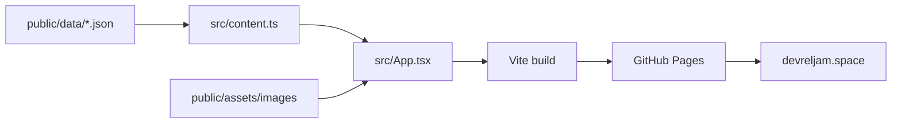

# DevRelJam Website

Config-driven React/Vite website for [devreljam.space](https://devreljam.space).

## Content Model

All public website content is loaded from JSON at runtime:

- `public/data/site.json`: brand, navigation, editorial hero copy, optional pathway data, format, city, CTA, footer, and UI text.
- `public/data/events.json`: upcoming and past DevRelJam events. The hero automatically selects the first future event by `startDate`.
- `public/data/people.json`: speakers and moderators. Speaker images use GitHub avatar URLs such as `https://github.com/{username}.png?size=160`; no speaker headshots are stored in this repo.
- `public/data/gallery.json`: previous Jam photos copied from the archived website/Luma-derived gallery assets, available behind feature flags.
- `public/data/feature-flags.json`: section and behavior toggles. Gallery and pathway sections are currently disabled to keep the homepage focused on the editorial landing-page flow.

When no upcoming event is present in `events.json`, the site uses the configured `nextEventStrategy.emptyState` instead of showing stale event details.

## Architecture



## Development

```bash
npm install
npm run dev
npm run lint
npm run build
```

The production build emits a static site to `dist/`.
