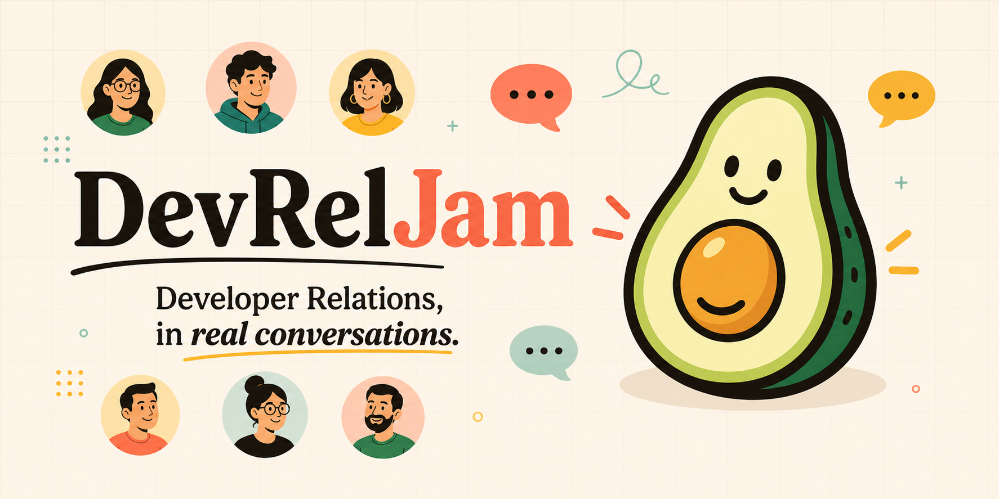
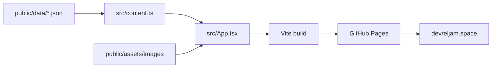

<p align="center">
  <a href="https://devreljam.space">
    
  </a>
</p>

# DevRelJam Website

Official, config-driven website for [devreljam.space](https://devreljam.space), built with React, Vite, Tailwind CSS, and GitHub Pages.

DevRelJam is a practitioner-first community where Developer Relations folks jam on what worked, what did not, and what they are learning while building developer communities.

## Quick Links

- Live site: [devreljam.space](https://devreljam.space)
- Luma calendar: [luma.com/devreljam](https://luma.com/devreljam)
- Speaker submissions: [sessionize.com/devreljam](https://sessionize.com/devreljam/)
- GitHub organization: [github.com/DevRelJam](https://github.com/DevRelJam)

## What This Repo Owns

- The public DevRelJam website and GitHub Pages deployment.
- Runtime-loaded JSON content for copy, navigation, events, people, gallery assets, and feature flags.
- Brand artwork, event artwork, previous Jam photos, favicon, and social preview images.
- SEO metadata and structured event schema derived from the same JSON content.

## Content Model

All public website content is loaded from JSON at runtime:

- `public/data/site.json`: brand, navigation, editorial hero copy, optional pathway data, format, city, CTA, footer, and UI text.
- `public/data/events.json`: upcoming and past DevRelJam events. The hero automatically selects the first future event by `startDate`.
- `public/data/people.json`: speakers and moderators. Speaker images use GitHub avatar URLs such as `https://github.com/{username}.png?size=160`; no speaker headshots are stored in this repo.
- `public/data/gallery.json`: previous Jam photos copied from the archived website/Luma-derived gallery assets, available behind feature flags.
- `public/data/feature-flags.json`: section and behavior toggles. Gallery and pathway sections are currently disabled to keep the homepage focused on the editorial landing-page flow.

Brand artwork lives in:

- `public/assets/images/devreljam-avocado-logo.png`
- `public/assets/images/devreljam-avocado-mark.png`
- `assets/readme/devreljam-github-banner.png`

When no upcoming event is present in `events.json`, the site uses `nextEventStrategy.emptyState` instead of showing stale event details.

## Architecture



## Development

```bash
npm install
npm run dev
npm run lint
npm run build
```

The production build emits a static site to `dist/`.

## Publishing

Commits to `main` trigger the GitHub Actions deployment workflow in `.github/workflows/deploy.yml`. The deployed site is served through GitHub Pages with `public/CNAME` set to `devreljam.space`.

Before pushing, run:

```bash
npm run lint
npm run build
```

## Content Update Checklist

- Update the relevant JSON file in `public/data/`.
- Keep dates in ISO format for event sorting and schema output.
- Use remote GitHub avatar URLs for speaker photos instead of storing headshots in the repo.
- Add local image assets under `public/assets/images/` with reusable, repo-relative paths.
- Run `npm run build` to verify the JSON can be loaded and bundled.
